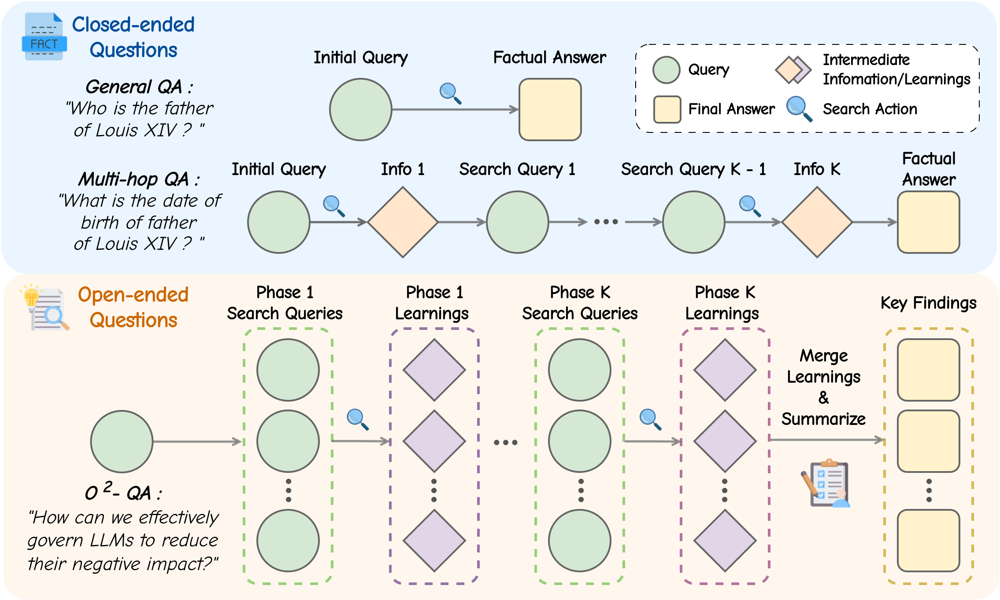
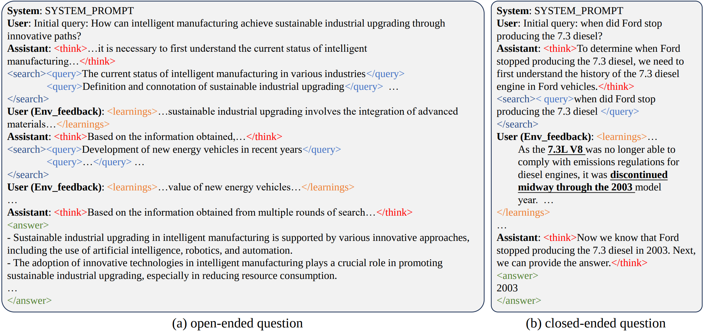
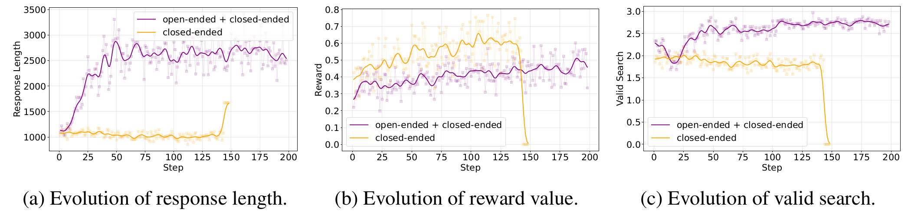

<div align="center">

# O²-Searcher

<div>
🚀 A Searching-based Agent Model for Open-Domain Open-Ended Question Answering 🌟
</div>
</div>
<div>
<br>

</div>


## Overview

Large Language Models (LLMs), despite their advancements, are fundamentally limited by their static parametric knowledge, hindering performance on tasks requiring open-domain up-to-date information. 
While enabling LLMs to interact with external knowledge environments is a promising solution, current efforts primarily address closed-end problems. Open-ended questions, which characterized by lacking a standard answer or providing non-unique and diverse answers, remain underexplored.
To bridge this gap, we present O²-Searcher, a novel search agent leveraging reinforcement learning to effectively tackle both open-ended and closed-ended questions in the open domain. O²-Searcher leverages an efficient, locally simulated search environment for dynamic knowledge acquisition, effectively decoupling the external world knowledge from model's sophisticated reasoning processes. It employs a unified training mechanism with meticulously designed reward functions, enabling the agent to identify problem types and adapt different answer generation strategies. 
Furthermore, to evaluate performance on complex open-ended tasks, we construct O²-QA, a high-quality benchmark featuring 300 manually curated, multi-domain open-ended questions with associated web page caches. Extensive experiments show that O²-Searcher, using only a 3B model, significantly surpasses leading LLM agents on O²-QA. It also achieves SOTA results on various closed-ended QA benchmarks against similarly-sized models, while performing on par with much larger ones.
<p align="center">

</p>

## Updates  📰
- **`2025-05-23:`** The paper is now available on [arXiv](https://arxiv.org/abs/2505.16582).
- **`2025-05-22:`** We opensource O²-Searcher codebase and the QA data of O²-QA benchmark.


## Getting Started 🎯
### Installation
```bash
# Recommend Python 3.10.
cd O2-Searcher
conda create -n o2searcher python=3.10
conda activate o2searcher
pip install -e ./verl
pip install -e .
pip install wandb 
pip install uvicorn
pip install bs4
pip install tavily-python
```

### Data
1. Download the [nq_hotpotqa](https://huggingface.co/datasets/PeterJinGo/nq_hotpotqa_train/tree/main) dataset processed by [Search-R1](https://github.com/PeterGriffinJin/Search-R1) and put it in the [directory](o2searcher/data/nq_hotpotqa/).
2. Generate the hybrid dataset.
```bash
./scripts/data/o2searcher_dataset.py --split [SPLIT]
```   

### Training Scripts
The training procedure consists of two stages, i.e., Cold Start and GRPO Training:

1. Cold Start:
```bash
./scripts/train/run_o2searcher_sft.sh [GPU_NUM]
```

2. GRPO Training:
   
Before running the training script, you should launch the [local search environment]() and the metric server.

(1) Local search environment
```bash
# For open-ended queries
python o2searcher/searcher/run_openended.py --local_url [MEILISEARCH_URL]
# For closed-ended queries
python o2searcher/searcher/run_closedended.py --local_url [DENSE_RETRIVER_URL]
``` 
(2) Launch the metric server 
```bash
python o2searcher/rewards/metrics/server.py
``` 
(3) Training
```bash
./scripts/train/run_o2searcher_grpo.sh
```

We welcome the community to try out different models, context lengths, and RL parameters in the training scripts!

### Inference
Download the pretrained [weights](https://huggingface.co/Jianbiao/O2-Searcher-Qwen2.5-3B-GRPO).


1. Launch the [local search environment](./o2searcher/searcher/search_env/README.md) or use web searching as follows:
  
(1) Local search environment
```bash
# For open-ended queries
python o2searcher/searcher/run_openended.py --local_url [MEILISEARCH_URL]
# For closed-ended queries
python o2searcher/searcher/run_closedended.py --local_url [DENSE_RETRIVER_URL]
```
(2) Web search
```bash
python o2searcher/searcher/run_api_tavily.py
```
2. Run inference
```bash
python scripts/eval/infer_agent.py -m [MODEL_PATH] -q [QUERY] -t [TAG]
```

3. Test on O²-QA benchmark

(1) After launching the search environment, run inference on the test set
```bash
python scripts/eval/infer_agent.py -m [MODEL_PATH] -q ./script/eval/query_list.txt -t [TAG]
``` 
(2) Launch the metric server 
```bash
python o2searcher/rewards/metrics/server.py
``` 
(3) Run the test script
```bash
python script/eval/test_llm.py --generate_dir [GENERATE_DIR]
``` 

### Preliminary results
1. Chat cases
<p align="center">

</p>

2. Incorporating open-ended data yields superior training stability, longer average
response lengths, and larger average search turns during the training procedure.
<p align="center">

</p>

## Roadmap 📌
- [x]  Training Code
- [x]  Evaluation Code
- [x]  Data for Coldstart
- [x]  Data for RL Training
- [ ]  Local Search Environment
- [ ]  Scale Up of Mode Size

## Acknowledgements
We utilized the following repos during development:

- [verl](https://github.com/volcengine/verl)
- [Qwen2.5](https://github.com/QwenLM/Qwen3/tree/v2.5)
- [Search-R1](https://github.com/PeterGriffinJin/Search-R1)
- [Deepseek-R1](https://github.com/deepseek-ai/DeepSeek-R1)
- [DeepScaleR](https://github.com/agentica-project/rllm/tree/deepscaler)


## Citation
If you find our paper and codes useful, please kindly cite us via:

```bibtex
@misc{mei2025o2searcher,
    title={O$^2$-Searcher: A Searching-based Agent Model for Open-Domain Open-Ended Question Answering},
    author={Jianbiao Mei and Tao Hu and Daocheng Fu and Licheng Wen and Xuemeng Yang and Rong Wu and Pinlong Cai and Xing Gao and Yu Yang and Chengjun Xie and Botian Shi and Yong Liu and Yu Qiao},
    year={2025},
    eprint={2505.16582},
    archivePrefix={arXiv},
    primaryClass={cs.CL}
}

```
